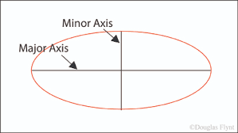
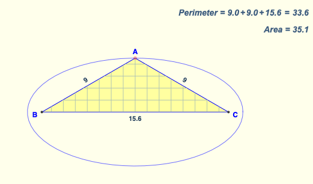
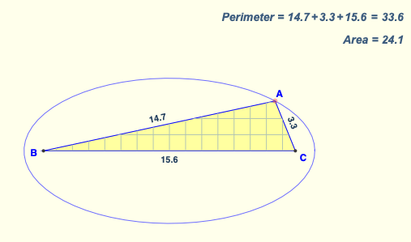
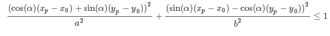
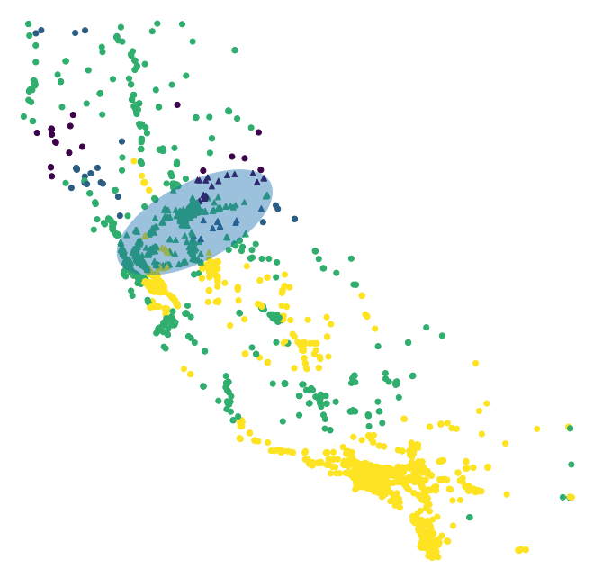

# Client Project: Identifying Areas At Risk for COVID-19 and Other Natural Disasters

--------------------------------------------------------------------------------------------------------------------------------------------------------------------
<h4>Authors: <a href="https://github.com/shiffdag">Shiffraw Dagenchaw</a>, <a href="https://github.com/sophiascarano">Sophia Scarano, <a href="https://github.com/oaagboro">Oghenevwede Agboro-Jimoh</a> </h4>

--------------------------------------------------------------------------------------------------------------------------------------------------------------------

## Executive Summary

        
 -------------------------------------------------------------------------------------------------------------------------------------------------------------------
 
 
 
 ## Problem Statement 
 
#### It is critical to mitigate and tame the diffusion of COVID-19 among people. Increased Social distancing is associated with lower rates of COVID- 19.  Providing a navigation tool that will equip people with information in regards to the density of COVID cases, in their vicinity, can potentially decrease the general exposure to COVID-19. Additionally, the navigation tool will provide functionality to view the areas currently affected by wildfires, whether these fires are contained or ongoing so that the user can avoid these areas accordingly.
 
 
 
### Underyling Goal 

#### The underlying goal is to construct an application that locates proximal gas stations within California,upon user request, by mechanism of minimizing exposure to covid hotspots. The application will additionally display location of fires that are ongoing in order to reduce the risk of the user.

### Content with Jupyter Notebooks
In this section, we highlight all of the steps we took to produce a functioning folium map.

## Steps:
### 1. Get data
#### a. Amenities
In order to access data regarding the amenities in California, we used OpenStreetMap's API. It has functionality such that if you query for the state of California and a specific amenity, it will return all of the information that it knows about these amenities in California arranged in a JSON dictionary.
#### b. Wildfires
First, we loaded data from https://www.fire.ca.gov/incidents/, and saved as 'fire_data.csv'. 
- For cleaning this file, we first decided to only keep information about wildfires as they are still an ongoing issue in California, instead of intormation on other disasters including floods and earthquakes. 
- We also decided to only keep information on fires that had burned at least one acre or more. 
- There were several columns, including extinguished_date and is_active, that we decided could be condensed into a column that we named 'status'. For status, we determined that there are three categories: 
    - **extinguished** (there is a value for extinguished_date and the is_active column is 'N')
    - **contained** (there is not a value for extinguished_date, but the is_active column is 'Y')
    - **ongoing** (the fire is still actively burning). 
- These designations were not arbitrary. We looked at many incidents online where we read about the fires corresponding to these rows, and most all of them used the terminology 'extinguished', 'contained', or 'ongoing' to describe the situation.
- Then, the radius of these fires was calculated based on the number of acres burned, first converting acres to square meters and then calculating the radius given a circle of said area.

#### c. COVID-19 Hotspots
We used data from the LA times. This section is elaborated in Shiffraw's section of this project. 

### 2. Analysis:
#### a. Determining county information
The most effective models with predicting COVID-19 hotspots based on location (using the COVID-19 dataset), perform the best when the county is included with the location's longitude and latitude. However, OpenStreetMap's API does not return the county that the amenities are in, only their coordinates.

In order to fix this issue, we predicted the county for each amenity location, based on a model that was trained and tested on the COVID-19 data. This model had a 93% accuracy on the training data and 91% accuracy on testing data, indicating that it is a good fit. Maybe things like gerrymandering make it less of a predictive model than it could be, but that is beside the point of this project.

#### b. Risk predictions: modeling
After generating the respective counties for each amenity location, we were ready to fit the model to the amenity data, predicting each amenity's proximity to a COVID-19 hotspot. The amenities were predicted to be classified into one of four groups: low risk, medium risk, high risk, and very high risk.

### 3. Folium Modeling
On the folium map, we decided that we would need to mark the amenities with a different visual representation than the wildfire areas or COVID-19 hotspots. Because of this, the visual representation of the map is described as follows:
- COVID-19 data: Opaque blue circles, with no rings on edge. 
    - The radius is represented in number of cases at that hotspot location
    - In folium, the radius is given in meters, so this radius is calculated assuming that everyone takes up one square meter. the actual radius is probably quite high in comparison
- Wildfire data:
    - Contained: Opaque orange circles, with no rings on edge. 
    - Ongoing: Opaque red circles, with no rings on edge. 
        - The radii for both of these are represented as the radius of the amount of fire burned at this location, based on the number of acres burned in the original data.
- Amenity data: individual filled in points
    - Very High Risk: Red
    - High Risk: Orange
    - Medium Risk: Yellow
    - Low Risk: Green

 

### 4. Folium Functionality
On the folium map, we decided that each of these items should be able to be interacted with. When clicked on, this is what each of these displays:
- COVID-19 data: Total number of confirmed cases in that area
- Wildfire data: The name of the fire, as well as its status (extinguished, confirmed, or ongoing)
- Amenity data: Name of location, and risk factor (low risk, medium risk, high risk, very high risk)

# Mapping given trip destinations
- More information available in 'master_code.ipynb' and draft_code/regions_viz.ipynb'

### 1. Is the target point within range?
- The 'range' is whatever is in the ellipse shown below, with the major axis representing the distance from your start and ending points

 

- In this ellipse, the perimeter represents the points at which your path has the same length. Becasuse of this, we decided that if the amenity (point **A**) is in the given ellipse, then your trip from point **B** to point **C** will be within the given time. The given time is expressed here as a variation in the minor axis, with the minor axis being larger if you allow for more time, and smaller if you allow for less. 

 
 

### 2. Ellipse rotations
- where (xp, yp) are the point coordinates and (x0, y0) is the center of the ellipse
- where a is the minor axis and b is the major axis

 

- Ellipse rotations proved to be difficult when dealing with longitude and latitude data, but this is the foundational equation on which all calculations were based.

### 3. Functions:
- **start_end_line**: given some start and stop point, determine and visualize the linear equation to connect them. Return tuple of (list of x components to plot, list of y components to plot)
- **get_midpoint**: Find the midpoint between two points. Return the midpoint coordinates.
- **angle_from_x_axis**: Given two points, find the angle their connecting line makes with the x axis. Returns theta in radians.
- **rotate_point**: Given a point, a center of rotation, and an angle to rotate (positive counterclockwise direction, in radians), return the coordinates of the rotated point.
- **is_in_ellipse**: Given a starting point, a stopping point, the maximum distance someone is willing to travel beyond their given itinerary, and a dataframe of the locations of amenities that they are interested in stopping at. Returns the same dataframe of points, except with an extra column where '0' means the location is not within the ellipse, and '1' means the location is in the ellipse. Also returns the start point, stop point, major_axis of the ellipse, minor_axis of the ellipse, and the rotated angle theta in degrees.
- **show_amenity_ellipse**: Given the output of **is_in_ellipse**, show a scatter plot of all of the amenities within this range. The color code is based on the covid safety rating.
- **get_ellipse_image**: Given the output of **is_in_ellipse**, save an image of the ellipse shown in **show_amenity_ellipse**, but ONLY the ellipse, NOT the amenities! This function is useful for folium implementation.

### 4. Visual representation
Although the folium detection is not working accurately yet with this implementation, this is the general idea of what it would look like if you were traveling between San Fransisco and  Lake Tahoe:

 

However, because of some ellipse compression rotation issues, it ends ub being a scooch off when you try to implement the image overlay. Below is an example of the image overlay when you input the starting and stopping locations as LA and Lake Tahoe, finding gas stations on the way:

 

In other drafts, the marker feature (locating markers for gas stations of low risk in the area) was working just fine, but isn't here for some reason.

# Conclusions:
To take this project further, we will implement:
- Increased functionality and runtime:
    - Be able to access JSON OpenStreetMap files more quickly
    - Have input prompts for start and end coordinates work with no issue
- Keep data up to date:
    - The number of COVID-19 cases is increasing daily. If this map were to keep track of updated case reports, we will be able to provide the safest and most accurate information.
    - This sentiment holds for wildfire data, too.

# References
- Map data copyrighted OpenStreetMap contributors and available from https://www.openstreetmap.org
- Wildfire data: https://www.fire.ca.gov/incidents/
- COVID-19 data: https://github.com/datadesk/california-coronavirus-data/blob/master/latimes-place-totals.csv
- Map data copyrighted OpenStreetMap contributors and available from https://www.openstreetmap.org
- Folium: https://python-visualization.github.io/folium/modules.html
- Image Overlay: http://qingkaikong.blogspot.com/2016/06/using-folium-5-image-overlay-overlay.html
- Ellipse Images: https://www.mathopenref.com/ellipseaxes.html
- Ellipse animation: https://nickcharlton.net/posts/drawing-animating-shapes-matplotlib.html

### 
